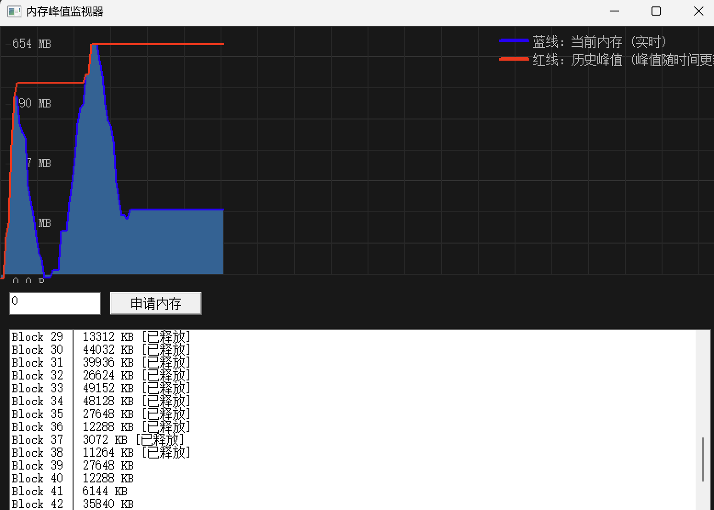

# MemoryMoniter

简单的 Windows GUI 程序，用于申请和监视进程内存峰值。

## 产品展示



程序界面包含：
- **上半部分**：实时内存使用图表
  - 蓝线：当前内存使用量（工作集）
  - 红线：历史内存峰值
  - 鼠标悬停显示详细信息
- **下半部分**：内存块管理界面
  - 输入框：指定要申请的内存大小（KB）
  - 申请内存按钮：分配指定大小的内存块
  - 内存块列表：显示已分配的内存块，双击可释放

构建方式：

- 使用 CMake（推荐）:
  - 需要安装 CMake 并将其加入 PATH。
  - 推荐通过命令行或批处理脚本执行构建（见下文）。

- 直接使用 MSVC (cl.exe):
  - 在 "Developer Command Prompt for VS" 中运行: 直接运行 `build_vs2019.bat`。

常见问题:
- 如果缺少 `cmake`，请安装 CMake 或使用 Visual Studio 的 Developer Prompt。
- 如果缺少 `cl.exe`，打开 Visual Studio 的 Developer Command Prompt 或执行 Visual Studio 安装目录下的 `vcvarsall.bat`。

## 功能特性

### 核心功能
- **实时内存监控**：在主窗口上半部分绘制进程内存使用曲线
  - 蓝色线：实时工作集大小
  - 红色线：历史峰值记录
- **内存分配管理**：下半部分提供内存块申请和释放功能
  - 支持手动指定大小或随机分配
  - 列表显示所有已分配的内存块
  - 双击列表项可释放对应内存块

### 性能优化
- **高效绘制**：使用双缓冲技术，避免界面闪烁
- **智能刷新**：只刷新必要的区域，减少CPU占用
- **防抖动**：鼠标移动事件防抖，减少不必要的重绘
- **内存管理**：优化数据结构操作，提高响应速度
- **数据采集**：程序通过周期性（默认 2 秒）查询本进程的内存信息，保存到历史数组并绘制曲线

关键函数说明：GetProcessMemoryInfo
-----------------------------------
程序使用 Windows API 函数 `GetProcessMemoryInfo`（声明于 `<psapi.h>`）来查询当前进程的内存使用信息。核心点：

- 作用：`GetProcessMemoryInfo(GetCurrentProcess(), &counters, sizeof(counters))` 会填充 `PROCESS_MEMORY_COUNTERS` 结构体，其中 `WorkingSetSize` 表示当前工作集（RSS），`PeakWorkingSetSize` 表示历史峰值工作集。程序把这些值作为“当前内存”和“峰值”绘入图表。
- 为什么重要：这是从操作系统层面准确获取进程物理内存使用（工作集）的标准方法，适用于 Windows 平台。相比自行统计堆分配，它反映的是整个进程在物理内存中的占用。
- 注意事项：
  - 该函数需要包含 `<psapi.h>` 并且在链接时通常不需要额外库（我们在 CMake 中明确链接了 `Psapi`）。
  - `WorkingSetSize` 单位为字节，程序对其进行了单位格式化（B/KB/MB/GB）。
  - 获取的数据是系统视角的瞬时值，采样间隔越小波动越明显；程序使用历史缓冲并进行缩放以便可视化。

如何运行（快速一键）
--------------------
- 使用批处理一键构建（推荐，默认 VS2019 x64 Debug）：
  ```powershell
  cd D:\workspace\MemoryMoniter
  .\build_vs2019.bat
  ```

更多
----
- 可以在 `main.cpp` 中调整采样频率（SetTimer 的间隔）、历史长度或图形样式。
- 如果要监视其它进程，可修改数据采集部分以使用 `OpenProcess` + `GetProcessMemoryInfo` 对特定 PID 进行查询（注意权限）。
